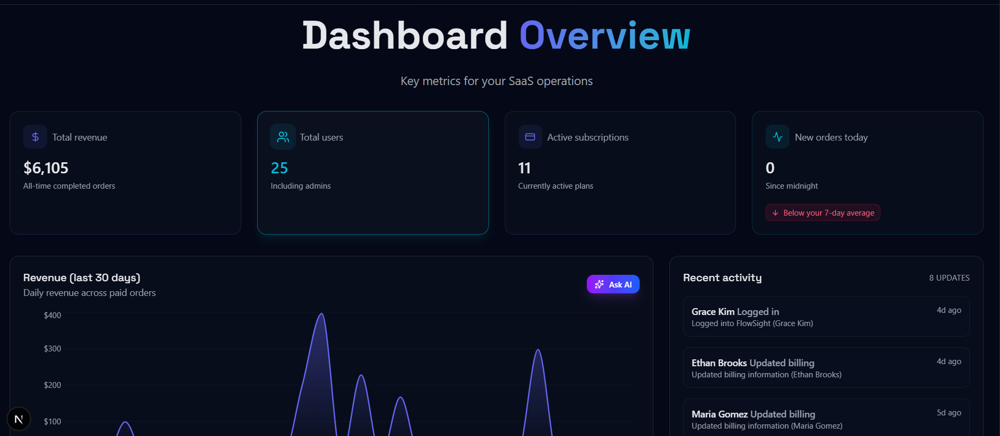
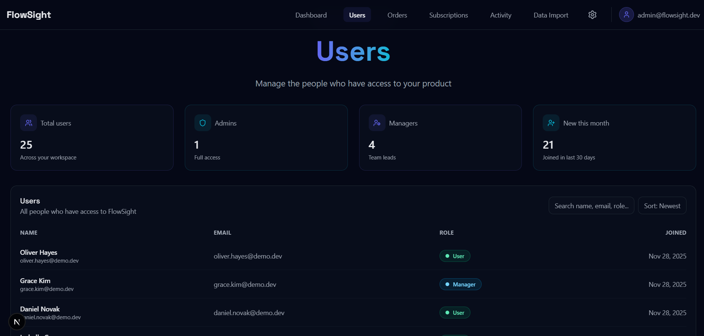
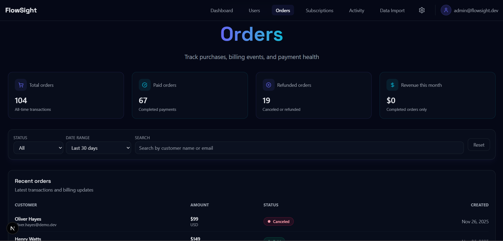
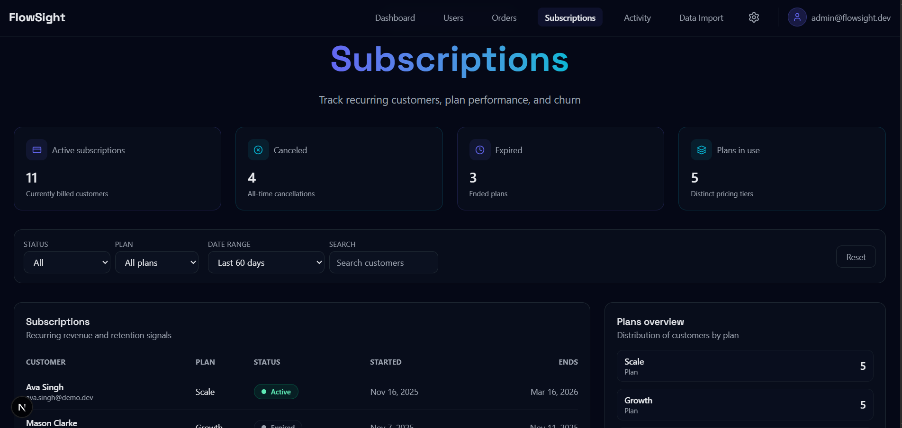
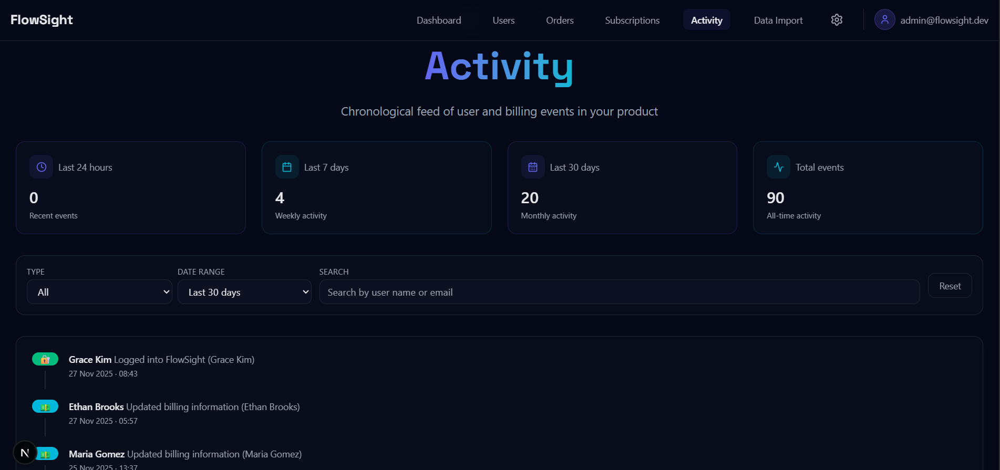
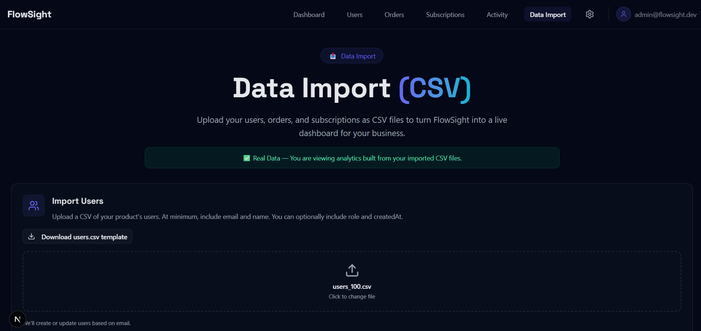
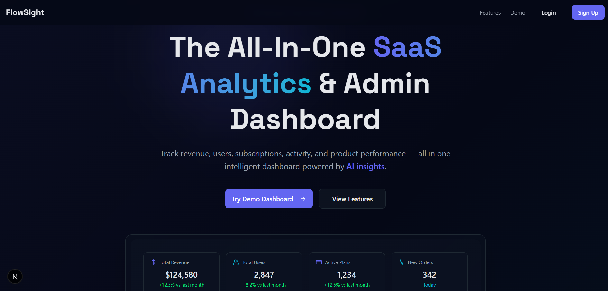

# 🌌 FlowSight — Modern SaaS Analytics Dashboard

> **Next.js 14 + Prisma + MongoDB**

FlowSight is a **production-ready SaaS analytics dashboard** featuring:

- 📊 Real-time metrics & charts  
- 🧠 AI-powered insights  
- 📥 CSV data import (Users, Orders, Subscriptions)  
- 🗂 Multi-tenant workspaces (Demo Mode → Real Data Mode)  
- 🔐 JWT Authentication  
- 🎨 Dark UI with shadcn/ui  
- ⚙️ Clean, modular architecture  

**Demo-ready. Client-ready. Production-ready.**

---

## 🔗 Live Demo (Production)

**🔗 [https://your-vercel-url.vercel.app/](https://your-vercel-url.vercel.app/)**

### Demo Login

- **Email:** `admin@flowsight.dev`
- **Password:** `Admin123`

---

## 🖼 Preview

<div align="center">

| Dashboard | Users Page | Orders Page |
|:---:|:---:|:---:|
|  |  |  |

| Subscriptions | Activity Timeline | Data Import |
|:---:|:---:|:---:|
|  |  |  |

| Homepage |
|:---:|
|  |

</div>

---

## ⭐ Features

### 🔐 Authentication
- Register / Login / Logout  
- Protected routes (middleware)  
- JWT stored in cookies  

### 🗂 Multi-Tenant Workspaces
- New users start in **Demo Workspace**  
- After CSV import → **Real Data Mode**  
- Complete data isolation per user/company  

### 📥 CSV Import System
Upload your own:
- `users.csv`  
- `orders.csv`  
- `subscriptions.csv`  

FlowSight instantly switches to **real analytics**.

### 📊 SaaS Metrics & Pages
- Dashboard overview  
- Users management  
- Orders analytics  
- Subscriptions & churn  
- Activity timeline  
- Settings page  

### 🧠 AI Insights (Mock or OpenAI)
- Explain charts  
- Summaries  
- KPI callouts  

---

## 🧪 CSV Formats

### users.csv
```csv
name,email,createdAt
John Doe,john@example.com,2024-01-05
Alice Johnson,alice@example.com,2024-01-10
```

### orders.csv
```csv
userEmail,amount,status,createdAt
john@example.com,49.99,PAID,2024-01-06
alice@example.com,79.00,PENDING,2024-01-12
```

### subscriptions.csv
```csv
userEmail,plan,status,startDate,endDate
john@example.com,Pro,ACTIVE,2024-01-05,2024-07-05
alice@example.com,Starter,CANCELLED,2024-01-10,2024-03-10
```

---

## ⚙️ Tech Stack

- **Next.js 14** (App Router)
- **React 19**
- **Prisma** + **MongoDB Atlas**
- **shadcn/ui**
- **Tailwind CSS**
- **Recharts**
- **Zod** + **React Hook Form**
- **JWT Auth**
- **TypeScript**

### 📁 Project Structure

```
app/
  (public)/
  (dashboard)/
  api/
components/
lib/
prisma/
hooks/
types/
```

---

## 🚀 Getting Started

### Prerequisites

- Node.js 18+ 
- MongoDB Atlas account (or local MongoDB)
- npm or yarn

### Installation

1. **Clone the repository**
   ```bash
   git clone https://github.com/Jatinsingh0/FlowSight.git
   cd FlowSight
   ```

2. **Install dependencies**
   ```bash
   npm install
   ```

3. **Set up environment variables**
   ```bash
   cp .env.example .env
   ```
   
   Update `.env` with your MongoDB connection string:
   ```env
   DATABASE_URL="mongodb+srv://..."
   JWT_SECRET="your-secret-key"
   ```

4. **Set up Prisma**
   ```bash
   npx prisma generate
   npx prisma db push
   ```

5. **Seed the database (optional)**
   ```bash
   npm run seed
   ```

6. **Run the development server**
   ```bash
   npm run dev
   ```

7. **Open [http://localhost:3000](http://localhost:3000)**

---

## 🧑‍💻 Author

**Jatin Singh** — Full-Stack Developer

- **Tech Stack:** Next.js • React • Prisma • MongoDB
- **LinkedIn:** [jatinsinghnextjs](https://www.linkedin.com/in/jatinsinghnextjs)
- **GitHub:** [@Jatinsingh0](https://github.com/Jatinsingh0)

---

## 🤝 Need a Custom Dashboard?

FlowSight can be adapted for:

- 🚀 SaaS startups
- 🏪 Marketplaces
- 💳 Subscription apps
- 📊 Admin panels
- 📈 Analytics dashboards

**DM me for collaboration.**

---

<div align="center">

**⭐ Star this repo if you find it helpful!**

</div>

